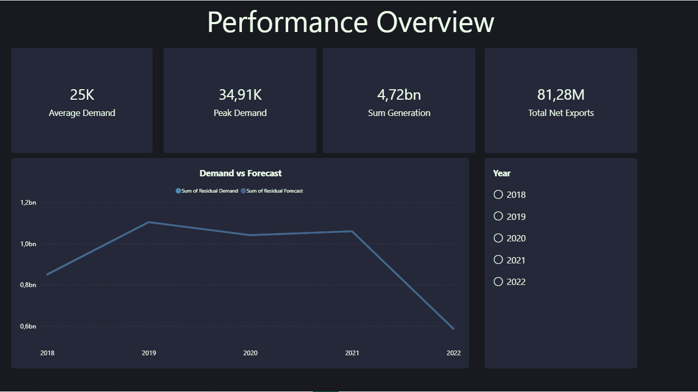
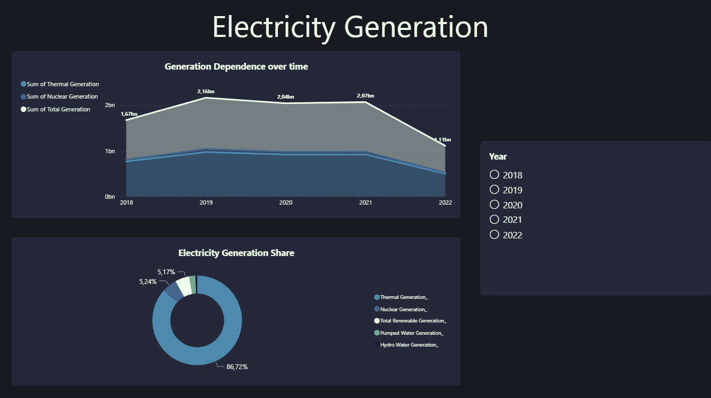
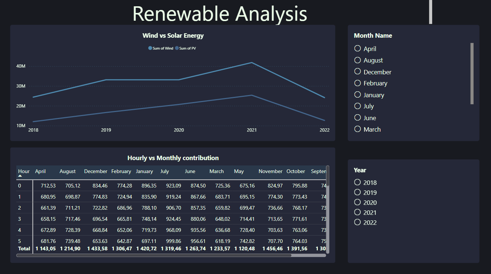
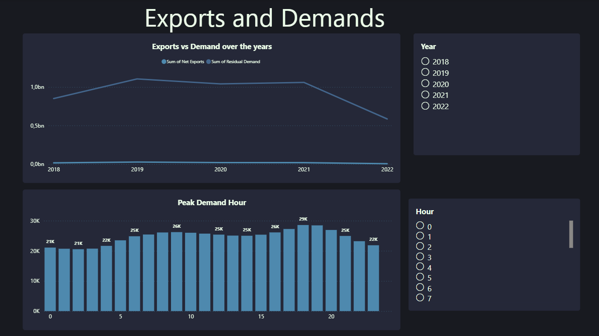

# Eskom Data Analysis

## Overview
This project analyzes South Africa’s electricity system using the **ESK2033 hourly dataset**, covering the period from **April 2018 to March 2023**.  
The objective is to uncover trends and understand electricity demand, export/import and generation patterns to derive insights and enforce the necessary precautions.

### Dashboards overview

##  Project Objectives
- Clean and prepare raw Eskom data using Microsoft Excel (Power Query) for analysis.
- Transform wide-format data into a tidy, analysis-ready structure.
- Communicate insights clearly using data visualization in Power BI.

## Dataset
### ESK2033.csv

### Cleaning steps:
1. Imported raw CSV data into Power Query
2. Converted the date column to a proper DateTime format
3. Extracted:
   - Year
   - Month
   - Month Name
   - Day
   - Hour
4. Handled missing values:
   - Generation and unit-hour columns replaced with `0`
5. Renamed columns for clarity and consistency
6. Created calculated columns:
   - Total Renewable Generation (Wind + Solar)
   - Total Pumped Storage Generation
   - Net Exports (Imports − Exports)
   - Total Generation

## Business Questions
- When does demand peak during the year?
- How much does the system rely on imports and exports?
- How reliable are renewables compared to thermal?
- Do renewables meaningfully contribute during peak demand periods?
- What hours show the highest system stress?
- What are the key risks identified from the analysis?

## Microsoft Excel
[ESK2033 Clean Data](excel) - Contains transformed data from the csv dataset.

## Power BI Dashboard
An interactive Power BI report was built to visualize key insights.

### Dashboard Pages:
1. **Performance Overview**
   - Average demand
   - Peak demand
   - Total generation
   - Net emports
   - Demand vs forecast trends

2. **Generation Mix**
   - Donut chart showing generation share by source
   - Stacked area chart showing changes over time

3. **Renewable Energy Analysis**
   - Wind vs solar generation trends
   - Hourly and monthly renewable patterns 

4. **Exports & System Stress**
   - Net exports vs demand
   - Peak demand by hour of day

## Key Insights
- Electricity demand consistently peaks during the evening hours (approximately 18:00–21:00) across all years analyzed.
- The system relies more heavily on imports during high-demand periods, particularly during peak hours.
- Thermal generation remains the dominant source (86.72%), while renewable energy (5.17%) has increased gradually but still represents a smaller share.
- Renewables contribute to total generation but do not consistently align with peak demand hours. Renewables alone cannot reduce peak demand stress without storage or thermal backup.
- The highest system stress occurs during evening peak hours, particularly when demand is high and renewable output is low.
- Some of the risks identified from the analysis:
  1. High dependence on thermal generation.
  2. Limited renewable contribution during peak demand.
  3. Persistent reliance on imports.
  4. Forecast inaccuracies during peak periods.
- An average power supply of 25K was recorded, with a peak value of 34,91K during peak hours.
  
## Recommendations?
- Invest more on renewable (solar and wind) energy to generate electricity and avoid generation from sources that are expensive.
- Avoid relying solely on imports during peak hours.
- Improving plant performance to reduce system stress.
